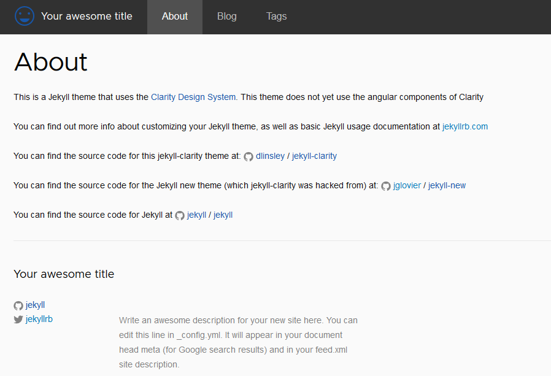

# jekyll-clarity

Jekyll sample using the [Clarity Design System](http://clarity.design)

## Goals
* Create an easy to use Jekyll theme that uses the UX guidelines and Style prescribed by the Clarity Design System
* Stay compatible with Github Pages

## How-To
### Build
`bundle exec jekyll build`

Site will be in the `_site` folder
### Preview
`bundle exec jekyll serve --host 0.0.0.0`

Site will be at `http://hostaddress:4000`

